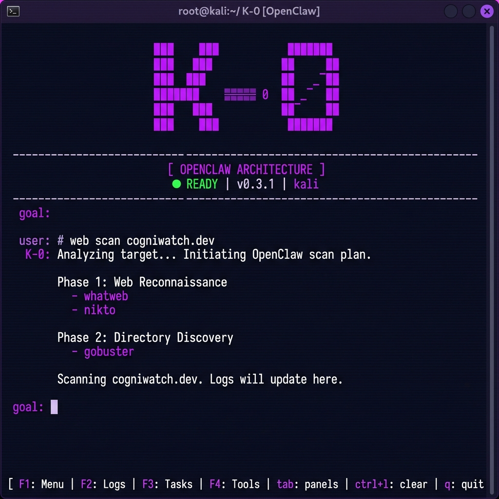

<p align="center">
  
</p>

<h1 align="center">K-0</h1>

<p align="center">
  <strong>AI-powered offensive security agent for Kali Linux</strong>
</p>

<p align="center">
  <a href="#features">Features</a> •
  <a href="#install">Install</a> •
  <a href="#usage">Usage</a> •
  <a href="#architecture">Architecture</a> •
  <a href="#license">License</a>
</p>

<p align="center">
  
  
  
  
  
  
</p>

---

K-0 is a **self-contained, offline-first security agent** for Kali Linux. It ships with its own AI model — no API keys, no cloud services, no configuration. Install it, type `k0`, and start hacking.

The embedded **k0-pentest** model is built on [Liquid AI's LFM2.5-350M](https://huggingface.co/LiquidAI/LFM2.5-350M) — a 267MB model purpose-built for tool calling, running at **300+ tokens/sec on CPU**. It generates structured attack plans from plain English goals, knows every Kali tool, and respects your engagement scope. Everything runs locally.

<p align="center">
  
</p>

## Features

### 🧠 Embedded AI — Zero Configuration
K-0 ships with everything it needs. The installer automatically:
- Installs Go/Ollama if missing
- Pulls the LFM2.5-350M base model (~267MB — fits on any machine)
- Creates the `k0-pentest` tool-calling wrapper via the bundled `Modelfile`
- Installs all essential Kali pentest tools
- Generates a default config at `~/.kiai/config.json`
- Loads the comprehensive Kali skills reference

**You never touch Ollama directly.** No API keys. No environment variables. Just `k0`.

### 🎯 Natural Language → Pentest Plan
Type your objective in plain English. K-0 generates a multi-phase attack plan:

```
goal: full recon on 192.168.1.0/24
```

K-0 responds with phased nmap/masscan/dnsrecon steps, shows exact commands, risk levels, and waits for your confirmation.

### ⚡ Instant Template Matching
Common pentest patterns (web scan, recon, DNS, brute-force) are matched instantly — **zero LLM latency**. Only novel or complex goals hit the AI model.

### 🔒 Human-in-the-Loop
**Nothing runs without your explicit approval.** Every plan shows exact commands, risk level, tool availability, and scope boundaries before you confirm.

### 🛡️ Scope Enforcement
Define your engagement scope. K-0 hard-refuses anything outside it — at the orchestrator level, not as a suggestion.

### 🔧 30+ Kali Tools + Metasploit Framework
K-0 ships with a comprehensive skills file that auto-loads with knowledge of every tool:

| Category | Tools |
|---|---|
| **Recon** | nmap, masscan, dnsrecon, whois, dig, fierce, theHarvester, recon-ng |
| **Web** | nikto, gobuster, whatweb, wapiti, dirb, sqlmap |
| **Exploitation** | metasploit-framework, searchsploit (20+ modules documented) |
| **Brute Force** | hydra, medusa, john, hashcat |
| **SMB/AD** | enum4linux, smbclient, crackmapexec |
| **Wireless** | aircrack-ng, wifite |

The skills file includes **Metasploit module references** (EternalBlue, Shellshock, WordPress, Jenkins, vsFTPd, etc.), **PTES methodology**, and **OWASP Top 10** testing procedures.

### 🖥️ Premium TUI
Built with [Bubbletea](https://github.com/charmbracelet/bubbletea) + [Lipgloss](https://github.com/charmbracelet/lipgloss):
- Multi-panel layout (Chat / Memory / Settings)
- Kali-inspired purple/dark theme
- Animated thinking indicator
- Keyboard-driven (Tab, Ctrl+L, Enter)

---

## Install

### Prerequisites
- **Kali Linux** (or any Debian-based distro)
- That's it. The installer handles everything else.

### One Command Install

```bash
git clone https://github.com/cogniwatchdev/k0.git
cd k0
chmod +x install/install.sh
./install/install.sh
```

The installer will:
1. ✅ Install **Go 1.22** if missing
2. ✅ Install **Ollama** if missing
3. ✅ Build the K-0 binary
4. ✅ Pull **LFM2.5-350M** (~267MB download)
5. ✅ Create the `k0-pentest` model with tool-calling template
6. ✅ Install **30+ Kali pentest tools** (nmap, nikto, sqlmap, metasploit, etc.)
7. ✅ Generate config at `~/.kiai/config.json`
8. ✅ Load skills to `~/.kiai/skills/`

### Run

```bash
k0
```

No setup wizards. No API keys. Just type your goal.

---

## Usage

### Basic Flow

```
1. Launch          →  k0
2. Set your goal   →  goal: web scan example.com
3. Review the plan →  K-0 shows phases, tools, risk level
4. Confirm         →  y / n
5. Watch results   →  Real-time tool output in the chat panel
```

### Keyboard Shortcuts

| Key | Action |
|---|---|
| `Tab` | Switch panels (Chat / Memory / Settings) |
| `Enter` | Submit goal or confirm |
| `Ctrl+L` | Clear chat |
| `i` | Install missing tool (when prompted) |
| `y` / `n` | Confirm or reject plan |
| `q` / `Ctrl+C` | Quit |

### Example Goals

```
goal: full recon on 10.0.0.0/24
goal: web scan and directory brute-force on target.com
goal: DNS enumeration for example.org
goal: check for default credentials on 192.168.1.1
goal: OWASP Top 10 assessment of webapp.local
goal: search for EternalBlue on 10.0.0.5
```

---

## Architecture

```
┌─────────────────────────────────────────────────────┐
│                    K-0 TUI                           │
│              (Go / Bubbletea)                        │
├──────────┬──────────┬───────────┬───────────────────┤
│  Chat    │  Memory  │ Settings  │  Status Bar       │
│  Panel   │  Panel   │  Panel    │  ● READY v0.4.0   │
├──────────┴──────────┴───────────┴───────────────────┤
│                                                      │
│  Orchestrator                                        │
│  ├── Template Matcher (instant plans)                │
│  ├── LLM Planner (novel goals → k0-pentest model)   │
│  ├── Scope Enforcer                                  │
│  └── Tool Executor (per-tool timeouts)               │
│                                                      │
├──────────────────────────────────────────────────────┤
│  Embedded k0-pentest model (via Ollama)              │
│  └── LFM2.5-350M (267MB) + ChatML tool-calling      │
│     Auto-managed · No user configuration             │
├──────────────────────────────────────────────────────┤
│  Skills (auto-loaded)                                │
│  └── KALI_TOOLS.md · soul/*.md                       │
│     30+ tools · Metasploit · PTES · OWASP           │
└──────────────────────────────────────────────────────┘
```

### Key Design Decisions

- **Self-contained** — AI model (267MB), skills, and tools are all embedded. The installer handles everything invisibly.
- **LFM2.5-350M** — Liquid AI's edge model: 300+ tok/s on CPU, purpose-built for tool calling. Beats models 10x its size on function-calling benchmarks.
- **Offline-first** — No cloud APIs, no telemetry, no data leaves the machine.
- **Template matching first** — Common pentest patterns are matched instantly. Only novel objectives hit the AI.
- **Per-tool timeouts** — Each tool execution has its own timeout to prevent hung scans.
- **Scope enforcement** — Hard boundaries at the orchestrator level.
- **Skills + Soul files** — Tool knowledge and persona are embedded as markdown.

---

## Soul Files

K-0's thinking is shaped by markdown knowledge files:

| File | Purpose |
|---|---|
| `skills/KALI_TOOLS.md` | Complete Kali tool reference with examples, Metasploit modules, PTES/OWASP |
| `soul/PERSONA.md` | Agent identity and communication style |
| `soul/MINDSET.md` | Red team methodology and thinking patterns |
| `soul/TOOLS.md` | Tool selection heuristics and preferences |
| `soul/TRADECRAFT.md` | Operational security guidance |
| `soul/OWASP.md` | OWASP Top 10 testing methodology |
| `soul/OSINT.md` | Open-source intelligence techniques |
| `soul/METASPLOIT.md` | Metasploit Framework usage patterns |
| `soul/REPORTING.md` | Report format and finding classification |

---

## Configuration

K-0 works out of the box. For power users, the config lives at `~/.kiai/config.json`:

```json
{
  "ollama_addr": "http://127.0.0.1:11434",
  "model": "k0-pentest:latest",
  "memory_path": "~/.kiai/memory",
  "semantic_memory": false,
  "web_search_enabled": false,
  "telemetry": false,
  "theme": "kali-purple"
}
```

Most users will never need to edit this.

---

## Roadmap

- [x] Multi-panel TUI with Bubbletea
- [x] Embedded LFM2.5-350M model (267MB, auto-install)
- [x] Template matching for instant plans
- [x] Tool verification & auto-install
- [x] Scope enforcement
- [x] Comprehensive Kali skills with Metasploit modules
- [x] Full Kali installer (Go, Ollama, tools, model)
- [ ] Streaming LLM responses
- [ ] PDF/HTML report export
- [ ] Plugin system for custom tools
- [ ] Multi-target campaign mode

---

## Contributing

```bash
git clone https://github.com/cogniwatchdev/k0.git
cd k0
go build -o k0 ./cmd/k0/
./k0
```

---

## Acknowledgements

- [Liquid AI / LFM2.5-350M](https://huggingface.co/LiquidAI/LFM2.5-350M) — Edge AI model for tool calling
- [Bubbletea](https://github.com/charmbracelet/bubbletea) — Terminal UI framework
- [Lipgloss](https://github.com/charmbracelet/lipgloss) — Style definitions
- [Ollama](https://ollama.com) — Local LLM runtime
- [Kali Linux](https://www.kali.org) — The penetration testing platform

---

## License

MIT — see [LICENSE](LICENSE) for details.

Built with 💜 by [CogniWatch](https://cogniwatch.dev)

---

<p align="center">
  <sub>K-0 is a security research tool. Always obtain proper authorization before testing systems you don't own.</sub>
</p>
